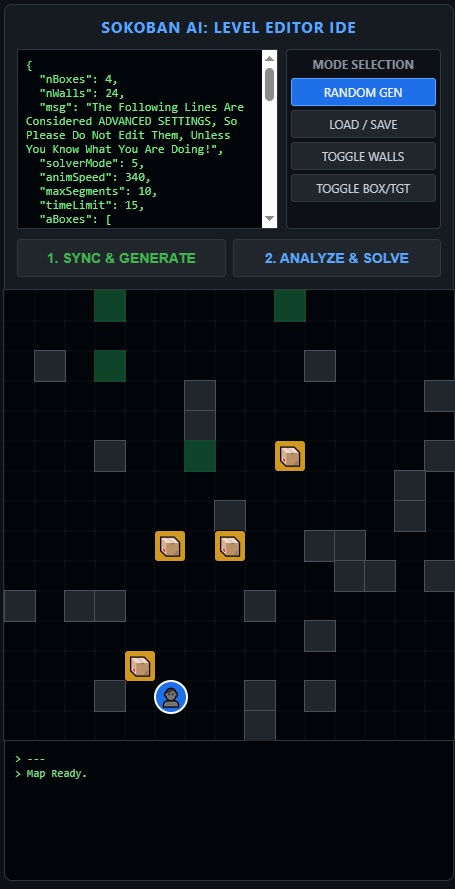

<table border="0">
  <tr>
    <td width="65%" valign="top">
      <h4>Sokoban AI Solver & IDE</h4>
      <b>🚀 Live Interaction Available:</b> <a href="https://puzzlegamesbyvk.github.io/Sokoban-AI-SOLVER-IDE-Level-Editor/" target="_blank" rel="noopener noreferrer">Open in a new Tab</a>
      

        A specialized Sokoban AI Solver powered by a Breadth-First Search (BFS) engine. 
        Designed as an interactive IDE, this tool allows users to stress-test logic 
        with custom puzzles or random layouts.
      

      

        Mobile-Friendly Design: The interface is optimized for various screen sizes, 
        ensuring that the grid and solver controls remain accessible and responsive 
        on mobile devices.
      

      

How to Use: Level DesignRandom Gen: Use the RANDOM GEN (DEFAULT) mode and click SYNC & GENERATE to create a new board. Switch to TOGGLE WALLS or TOGGLE BOX/TGT to draw directly on the grid. The JSON in the config area updates in real-time. Selecting a solverMode value in the configuration text area before clicking ANALYZE & SOLVE: Mode 1 (Linear): Solves boxes in their default order to assigned targets. Fastest, but easily blocked. Mode 2 (Target Carousel): Keeps box order fixed but tries every permutation of target assignments (N!). Mode 3 (Box Carousel): Keeps target assignments fixed but tries every possible order of moving the boxes (N!). Mode 4 (Deep Search): The most powerful mode. Tries every combination of box orders AND target assignments (N!*N!). Use this for tangled clusters. ExecutionClick ANALYZE & SOLVE. Watch the Log below the grid to see the AI's thought process as it tests different permutations. If a solution is found, the Animation will trigger automatically at the speed defined by animSpeed.
      

    </td>
    <td width="35%" valign="top">
      
      
<i>Responsive IDE Preview</i>

    </td>
  </tr>
</table>
